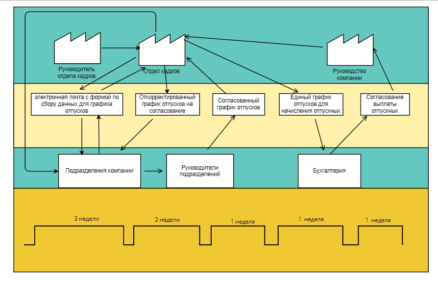
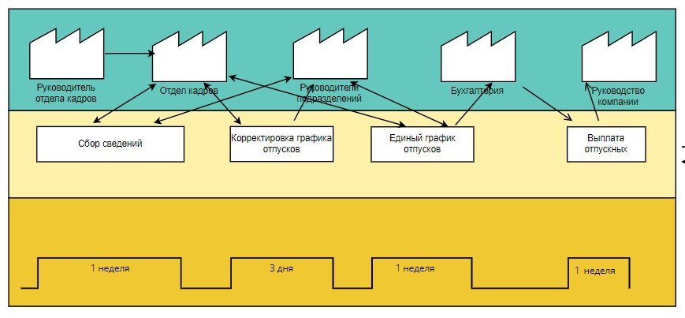

# Гибкие методологии (Agile, SCRUM, Канбан и другие) (семинары)
## Практическое задание. Урок 4. Lean

1. Проанализируйте свою повседневную работу или работу отдела в вашей компании на наличие потерь.

2. Нарисуйте VSM-карту.
3. Найдите потери и классифицируйте их в соответствии с материалом лекции.
4. Подумайте, как исключить эти потери.
5. Нарисуйте новую VSM-карту в соответствии с вашими предложениями.
Вы можете использовать все рекомендованные на семинаре программы для рисования VSM-карты. В качестве выполненного задания приложите скрин или PDF-файл с VSM-картой и ответом на вопросы.

*Решение*

За основу взята работа по утверждению графика отпусков в компании.

1. Информационный поток
2. Производственный поток
3. Временной поток

__Анализ потерь:__

Потери из-за перепроизводства: в процессе формирования графика отпусков создается множество промежуточных документов, которые не будут использованы в дальнейшей работе
Потери из-за ожидания: на согласования графика отпусков уходит большое количество времени
Потери при ненужной транспортировке: в результате работы над составлением графика отпусков используются разные программы большим количеством людей
Потери из-за лишних этапов обработки: процесс утверждения графика отпусков в компании требует нескольких кругов согласования

__Предложения по исключению потерь:__

Внедрить в компанию единую программу, которая позволит распределить задачи по формированию графика отпусков по отделам, назначить ответственных за исполнение задач лиц, установить сроки выполнения задач, а также согласовать итоговый график с бухгалтерией и руководством. Также это позволит оперативно доносить итоговую информацию до руководителей отделов или даже сотрудников компании (при условии, что компания небольшая).

